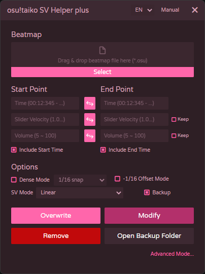

<p align="center">
  
</p>

# osu!taiko SV Helper plus
A fork of osu!taiko SV Helper with bug fixes and a few additional features.

This version is based on the original osu!taiko SV Helper and includes fixes for issues found in the original tool, as well as small improvements for osu!taiko mapping workflows.

## Changes from the original version

### Bug fixes

- Fixed an issue where using the `delete` or `modify` buttons could unintentionally modify uninherited timing points. These actions now only affect inherited timing points, also known as green lines.

### Added features

- Added `1/8 dense mode` in addition to the existing `1/16 dense mode`.
- Added automatic SV point creation on barlines when using normal overwrite mode. barline positions are calculated from uninherited timing points, using `beatLength * meter`, and the final timestamp is floored.
- Overwrite now replaces existing inherited timing points within `+-1ms` of the target time.
- Removed the Kiai option. Overwrite inherits Kiai/effects from the start point, and Modify preserves each timing point's existing effects.
- Replaced the old Exponential checkbox with an `SV Mode` selector.
- Added small `Keep` checkboxes for velocity and volume. When enabled, the original inherited value is kept instead of using the input value.
- Volume input now accepts only values from `5` to `100`.

## SV Mode

SV Mode controls how Slider Velocity and Volume are interpolated between the start value and the end value.

Let:

- `t = (currentTime - startTime) / (endTime - startTime)`
- `s = startValue`
- `e = endValue`
- `value(t)` is the interpolated value at progress `t`

The domain is normally `0 <= t <= 1`.

### Linear

```
value(t) = s + t * (e - s)
```

This is the default mode. The value changes by a constant difference over time.

### Ratio

```
value(t) = s * (e / s) ^ t
```

The value changes by a constant ratio over time.

### Cubic In / Accelerate Curve

```
value(t) = s + t^3 * (e - s)
```

The value changes slowly at the beginning and faster near the end.

### Cubic Out / Decelerate Curve

```
value(t) = s + (1 - (1 - t)^3) * (e - s)
```

The value changes faster at the beginning and slowly near the end.

### Sine In / Accelerate Curve

```
value(t) = s + (1 - cos(t * pi / 2)) * (e - s)
```

The value changes slowly at the beginning and faster near the end, with a smoother sine-shaped curve than Cubic In.

### Sine Out / Decelerate Curve

```
value(t) = s + sin(t * pi / 2) * (e - s)
```

The value changes faster at the beginning and slowly near the end, with a smoother sine-shaped curve than Cubic Out.

For Slider Velocity, the final inherited timing point beat length is calculated as:

```
beatLength = -100 / value(t)
```

For Volume, the interpolated value is rounded to the nearest integer.

## Requirement
* Node.js 14.16.0 or later

## Build
#### Serve Application
```
> cd PROJECT_FOLDER
> npm install
> npm test
> npm start
```
#### Build Executable File
```
> cd PROJECT_FOLDER
> npm install
> npm test
> npm run build:win64  ---  64bit
> npm run build:win32  ---  32bit
```
